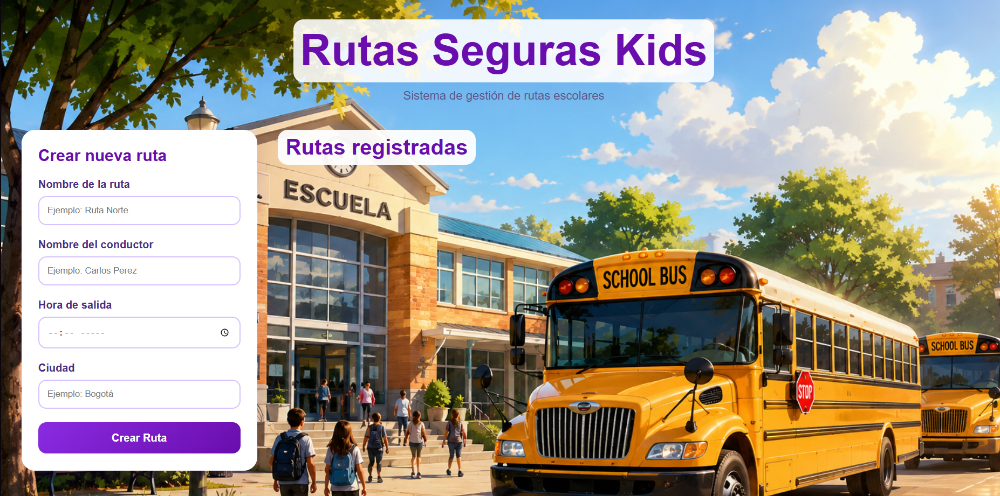
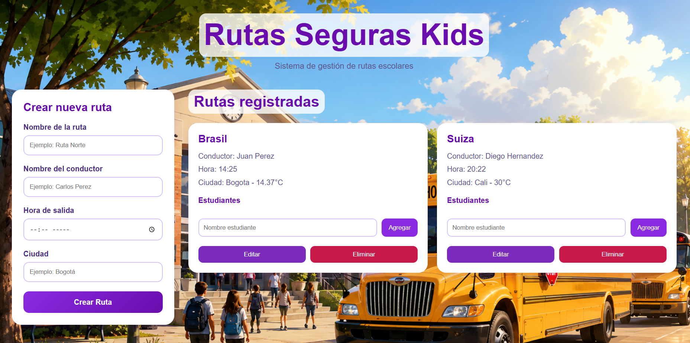

# Rutas Seguras Kids 🚍

Sistema frontend desarrollado con **HTML, CSS y JavaScript Vanilla** para la gestión de rutas escolares y asignación de estudiantes.  
El proyecto permite crear rutas dinámicamente, agregar estudiantes, editar información, eliminar rutas y consultar el clima de la ciudad mediante una API pública.


---

# 📌 Características

- ✅ Creación dinámica de rutas escolares.
- ✅ Asignación de estudiantes a cada ruta.
- ✅ Edición y eliminación de rutas.
- ✅ Manipulación dinámica del DOM.
- ✅ Validación de formularios.
- ✅ Uso de `CustomEvent`.
- ✅ Consumo de API pública con `fetch` y `async/await`.
- ✅ Uso de `<template>` para reutilización de componentes.
- ✅ Diseño responsive.
- ✅ Organización separada de HTML, CSS y JavaScript.

---

# 🛠️ Tecnologías utilizadas

- HTML5
- CSS3
- JavaScript Vanilla
- OpenWeather API

---

# 📂 Estructura del proyecto

```bash
📁 rutas-seguras-kids
│
├── index.html
├── style.css
├── script.js
├── Img
│   └── fondo-escolar.png
└── README.md
```

---

# 🚀 Funcionalidades principales

## 📍 Gestión de rutas

El sistema permite:

- Crear rutas escolares.
- Asignar conductor.
- Definir hora de salida.
- Registrar ciudad de operación.
```javascript
const nuevaRutaObjeto = {
    ruta: nombreRuta.value,
    conductor: nombreConductor.value,
    hora: horaSalida.value,
    ciudad: ciudadRuta.value,
    temperatura: temperatura
};

rutas.push(nuevaRutaObjeto);
```

---

## 👨‍🎓 Gestión de estudiantes

Cada ruta permite:

- Agregar estudiantes dinámicamente.
- Mostrar estudiantes en pantalla.
- Validar que el campo no esté vacío.

```javascript
btnAgregarEstudiante.addEventListener("click", () => {

    const nombreEstudiante = inputEstudiante.value.trim();

    if (nombreEstudiante === "") {
        alert("Ingrese el nombre del estudiante");
        return;
    }

    const estudianteItem = document.createElement("li");

    estudianteItem.textContent = nombreEstudiante;

    listaEstudiantes.appendChild(estudianteItem);

});
```

---

## ✏️ Edición de rutas

Cada tarjeta cuenta con:

- Botón para editar información.
- Botón para guardar cambios.
- Botón para cancelar edición.

```javascript
btnGuardarEdicion.addEventListener("click", () => {

    tituloRutaEl.textContent = nuevoRuta;

    conductorEl.textContent = `Conductor: ${nuevoConductor}`;

    horaEl.textContent = `Hora: ${nuevaHora}`;

    ciudadEl.textContent = `Ciudad: ${nuevaCiudad}`;

});
```

Este código permite agregar estudiantes dinámicamente a cada ruta utilizando manipulación del DOM.

---

## 🗑️ Eliminación de rutas

```javascript
btnEliminar.addEventListener("click", () => {

    tarjetaElemento.remove();

});
```

Permite eliminar rutas directamente desde la interfaz.

---

# 🌦️ Consumo de API

El proyecto utiliza la API de OpenWeather para obtener la temperatura de la ciudad ingresada.

```javascript
async function obtenerClima(ciudad) {

    const apiKey = "98a1bb55ebe4e29a656ab2d1d6c02c1e";

    const url =
    `https://api.openweathermap.org/data/2.5/weather?q=${ciudad}&appid=${apiKey}&units=metric&lang=es`;

    const respuesta = await fetch(url);

    const datos = await respuesta.json();

    return datos.main.temp;
}
```

## Tecnologías utilizadas

- `fetch()`
- `async/await`
- Manejo de errores con `try/catch`

## Ejemplo de funcionamiento

```javascript
const temperatura = await obtenerClima(ciudadRuta.value);
```

---

# ⚡ Eventos personalizados

El sistema implementa un evento personalizado utilizando `CustomEvent`.

## Evento utilizado

```javascript
new CustomEvent("estudianteAgregado")
```

Este evento se ejecuta cuando un estudiante es agregado a una ruta.

---

# 🧩 Templates

Se utiliza la etiqueta `<template>` para reutilizar la estructura de las tarjetas de rutas dinámicamente.

## Ejemplo

```html
<template id="templateRuta">
```

---

# 📱 Responsive Design

El proyecto cuenta con diseño responsive mediante `@media queries` para:

- 📱 Celulares
- 💻 Tablets
- 🖥️ Escritorio

---

# 🧠 Conceptos aplicados

- Manipulación del DOM
- Eventos
- Asincronía
- Fetch API
- Arrays y objetos
- Templates
- Validación de formularios
- Custom Events
- Responsive Design

---

# ▶️ Cómo ejecutar el proyecto

1. Descargar o clonar el repositorio.
2. Abrir la carpeta del proyecto.
3. Ejecutar el archivo `index.html` en el navegador.

---

# 📸 Vista previa

Sistema de gestión escolar con tarjetas dinámicas para rutas y estudiantes, incluyendo clima en tiempo real.


---

# 👨‍💻 Autor

Proyecto desarrollado por `Mario Rojas` como práctica de JavaScript Vanilla y manipulación dinámica del DOM.


